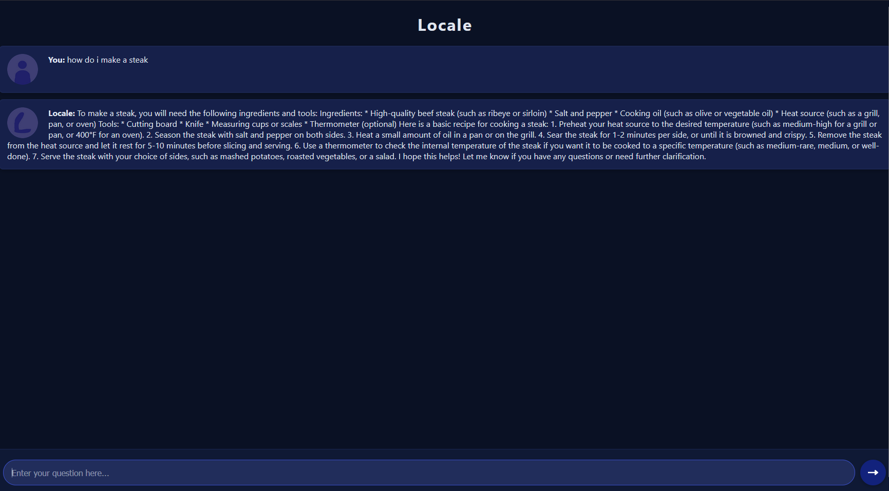

# 

**Locale** is a fast, lightweight, and private AI chatbot you can run entirely on your own computer.  
No cloud, no tracking—just instant, secure conversations powered by open-source technology.

---

## 🚀 Features

- ⚡ **Lightweight:** Minimal resource usage, runs locally on your machine.
- 🔒 **Private:** Your data never leaves your device.
- 💬 **Conversational:** Natural chat interface, always ready to help.
- 🖥️ **Open Source:** Fully transparent and customizable.

---

## 🖼️ Preview



---

## 📦 Installation/Launching
- 1 - note I have only tested on windows so for linux and mac good luck -
- 2 - Download the .zip in the releases section of the rep
- 3 - download ollama at https://ollama.com/download
- 4 - open ollama installer and download it
- 5 - go into your command promt and type ollama  ```` ollama pull llama2 ```` this will download the ai model
- 6 - make sure you have python downloaded you can downlaod it in the microsoft store
- 7 - Unzip the folder you downloaded from the releases and open it
- 8 - cd into the folder directory in command prompt and do this command ````pip install requirements.txt````
- 9 - Either open it by double clicking the python file or using the cd command to cd into the folder and running ````python main.py ````
- 10 - now go to http://localhost:8000 or type your local ip and :8000 at the end to access the website (it should tell you the link in the program)
- not working? - put it in the issues tab i will assist and help as much as i can!
